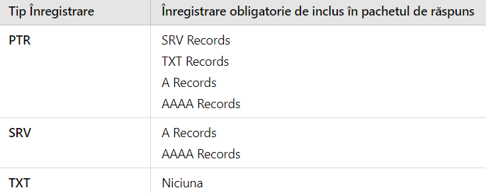

# Implementare mDNS si DNS-SD. Aplicație demonstrativă.

## Proiect realizate de:

## Bîrleanu Andreea

## Tanasă Ana-Maria

## Ce este mDNS?

mDNS (Multicast DNS) este un protocol care funcționează similar cu DNS
(Domain Name System), dar este special conceput pentru utilizarea în
rețele locale (LAN). Spre deosebire de DNS, care necesită un server
centralizat pentru a traduce numele de domeniu în adrese IP, mDNS
permite dispozitivelor să comunice între ele direct, fără a necesita un
server DNS dedicat. Atunci când un dispozitiv din rețea are nevoie de o
adresă IP asociată unui anumit nume, trimite o cerere prin intermediul
multicast către toate dispozitivele din rețea. Dacă un dispozitiv
recunoaște acel nume, el răspunde cu adresa sa IP.

## Cum funcționează mDNS?

Funcționarea mDNS implică următorii pași:

1.  Întrebarea Clientului: Dispozitivul care solicită informații
    (clientul) trimite o întrebare în rețea, specificând numele de
    domeniu dorit. Această cerere este transmisă pe un canal special de
    multicast, folosind adresa de grup multicast 224.0.0.251 și portul
    5353.
2.  Recepția Cererii: Toate dispozitivele din rețea care ascultă la
    această adresă multicast primesc cererea.
3.  Răspunsul Dispozitivului: Dacă există un dispozitiv în rețea cu
    numele respectiv, acesta va răspunde, trimițând adresa sa IP înapoi
    prin multicast.
4.  Comunicarea Directă: Clientul primește răspunsul cu adresa IP și
    poate începe comunicarea directă cu dispozitivul respectiv, folosind
    acea adresă.

## Formatul unei interogări mDNS

O interogare mDNS este un pachet UDP care include următoarele componente
principale:

Header-ul DNS (12 octeti): Acesta este primul segment al pachetului și conține
informații esențiale despre interogare.

-   Identificator (ID): Un număr unic folosit pentru a asocia cererea cu
    răspunsul.
-   Flags: Un câmp care specifică tipul de interogare:

1.  QR (Query/Response) Bit: 0 pentru cereri, 1 pentru răspunsuri.
2.  OPCODE (4 biți, Standard query(0)): În ambele situații trebuie să
    fie 0 la transmisie, iar mesajele primite cu un OPCODE diferit
    trebuie să fie ignorate.
3.  AA (Authoritative Answear) Bit: În interogări, bitul AA este mereu
    zero la transmisie și ignorat la recepția mesajului. În răspunsuri,
    bitul AA trebuie să fie unu, dar este de asemenea ignorat de
    dispozitivele care primesc răspunsul.
4.  TC (Truncated) Bit: În interogări bitul TC indică dacă vor urma
    înregistrări suplimentare de tip Known-Answer. În răspunsurile
    multicast bitul TC trebuie să fie zero și este ignorat la recepție.
5.  RD (Recursion Desired): În interogările și răspunsurile multicast,
    bitul RD ar trebui să fie zero la transmitere. Acest lucru
    semnalează că nu se dorește recursivitate. Trebuie să fie ignorat la
    recepție.
6.  RA (Recursion Available): 0 la transmitere, ignorat la recepție
    pentru că recursivitatea nu este utilizată în mDNS.
7.  Z (Zero) Bit: Este un bit rezervat care trebuie să fie 0 la
    transmitere, ignorat la recepție. Nu are o funcție specifică în
    mDNS.
8.  AD (Authentic Data) Bit: 0 la transmitere, ignorat la recepție
    pentru că autentificarea datelor nu se aplică.
9.  CD (Checking Disabled) Bit: 0 la transmitere, ignorat la recepție,
    deoarece nu este relevant pentru mDNS.
10.  RCODE (Response Code): Este codul de răspuns care indică succesul
    sau eșecul unei interogări DNS, trebuie să fie întotdeauna 0 (ceea
    ce înseamnă \"fără eroare\").

-   Numărul de înregistrări (Questions): Numărul de întrebări din
    interogare (de obicei, 1 pentru o interogare standard).
-   Numărul de înregistrări de răspuns (Answers RRs): Numărul de
    răspunsuri (de obicei, 0 pentru o interogare).
-   Numărul de înregistrări autoritative (Authority RRs): Numărul de
    înregistrări de autoritate (de obicei, 0 pentru o interogare).
-   Numărul de înregistrări adiționale (Additional RRs): Numărul de
    înregistrări adiționale (de obicei, 0 pentru o interogare).

Întrebare (Question Section):

-   Numele gazdei pentru care se face cererea
-   Tipul de înregistrare (A, AAAA, PTR, SRV, TXT)
-   Clasa

## Completări mDNS
* Folosește doar utf8 pentru a reprezenta numele de domenii primite drept răspuns.
* Permite mai multe întrebări într-un mesaj.
* Folosește răspunsuri nesolicitate pentru a anunța noi înregistrări.
* Trebuie să "asculte" răspunsuri noi la o întrebare, în caz că o gazdă revine din modul sleep.
* Poate folosi un cache pentru a reține înregistrări (doar cât nu se depășește TTL).
* Retransmite la un anumit interval de timp informația.

## Ce este DNS-SD?

DNS-SD (DNS Service Discovery) este o extensie a protocolului DNS care
facilitează descoperirea serviciilor disponibile într-o rețea locală sau
globală. Acesta este utilizat pentru a identifica și accesa servicii
precum imprimante pentru primirea documentelor sau servere web locale
care rulează aplicații web, în combinație cu mDNS (Multicast DNS).

Acesta are o caracteristică utilă care permite serverului DNS să adauge
înregistrări suplimentare în mesajul DNS. Aceste înregistrări nu sunt
cerute direct de client, dar serverul consideră că ar putea fi relevante
pentru client în viitor și, prin urmare, le include pentru a economisi
timp:

1.  Înregistrările SRV (Service Record) specifică locația unui serviciu
    în rețea. Formatul este următorul: \_service.\_proto.name. TTL
    class SRV priority weight port target.
    O înregistrare SRV are un nume de forma "Instance.Service.Domain" și oferă host-ul și portul unde instanța de 
    serviciu poate fi accesată. Înregistrarea DNS TXT cu același nume oferă informații suplimentare despre această 
    instanță, într-o formă structurată folosind perechi de cheie/valoare. De exemplu, o înregistrare SRV cu 
    numele "_http._tcp.example.com" ar permite unui client să descopere serverele care implementează serviciul 
    "_http._tcp" (adică servere web) pentru domeniul "example.com".

2.  Înregistrările PTR (pointer record) leagă un nume de domeniu de o
    adresă IP (reverse lookup). Numele acesteia este adresa IP în format
    inversat, urmată de sufixul in-addr.arpa pentru adrese IPv4 sau
    ip6.arpa pentru cele IPv6.

3.  Înregistrările A și AAAA sunt tipuri de înregistrări DNS folosite
    pentru a asocia numele de domeniu cu adresele IP.

    Înregistrarea A (Address Record) asociază un nume de domeniu cu o adresă
    IPv4(32 biți).

    Înregistrarea AAAA (Quad A Record) asociază un nume de domeniu cu o
    adresă IPv6 (128 biți).

4.  Înregistrările TXT permit stocarea de informații textuale asociate
    cu un nume de domeniu. Fiecare serviciu DNS-SD **TREBUIE** să aibă o
    înregistrare TXT în plus față de înregistrarea SRV, cu același nume,
    chiar și în absența datelor adiționale. Dimensiunea totală ar trebui
    să fie mică, ideal sub 200 de octeți. Înregistrările stochează
    perechi cheie/valoare.

    Reguli pentru chei în perechile cheie/valoare:

    -   Cheia TREBUIE să aibă cel puțin un caracter și AR TREBUI să aibă cel
        mult nouă caractere pentru eficiența rețelei.
    -   Cheile sunt case insensitive.
    -   Dacă o cheie apare de mai multe ori, doar prima apariție va fi
        considerată.

## Formatul mesajului

### Antet:
    1. ID (Query Identifier):
        * Întrebări multicast- 0 la transmisie
        * Răspunsuri multicast- 0 la transmisie, ignorat la recepție
    2. Bitul Top:
        * Întrebare: setat pe 1 dacă se preferă răspunsuri de tip unicast (dacă nu e nevoie să transmită tuturor 
          dispozitivelor răspunsul)
        * Răspuns: 1 dacă face parte dintr-un pachet de răspunsuri( de ex un PC care a repornit sau și-a schimbat adresa IP)

### Întrebări:
* Una sau mai multe intrări de tipul QDCOUNT
* QDCOUNT conține:
  
      1. QNAME: Nume de domeniu reprezentat printr-o secvență de etichete de lungime variabilă, primul octet din fiecare 
         reprezentând dimensiunea(vezi secțiune comprimare mesaj în cadrul mDNS).Acesta se încheie cu un octet de 0.
  
      2. QTYPE: Cod de 2 octeți pentru a specifica tipul întrebării.(ex: A record->1,PTR->12,TXT->16,AAA->28,SRV->33)
  
      3. QCLASS: Cod de 2 octeți pentru clasa întrebării(Internet[IN]-1,ANY-255)

  ### Răspuns
  Înregistrările autoritative( “Authority RR”), înregistrările de răspuns( “Answer RR”) și înregistrările adiționale( 
  “Additional RR”) au același format.
  1. Name: Numele de domeniu (analog codificare QNAME)
  2. Type: Cod de 2 octeți cu codificarea tipului de răspuns(ex A record->1, ,PTR->12,TXT->16,AAA->28,SRV->33)
  3. Class: Cod de 2 octeți pentru clasa tipului de răspuns(Internet[IN]-1,ANY-255)
  4. TTL: Nr natural pe 4 octeți ce semnifică câte secunde mai poate fi reținut răspunsul pentru utilizări viitoare. Dacă 
     este 0,atunci răspunsul este valabil doar pentru tranzacția curentă.
  5. RDLENGTH: Nr natural pe 2 octeți reprezentând lungimea câmpului RDATA(în octeți)
  6. RDATA: Șir de caractere ce descrie resursa(ex pt o înregistrare de tip A și de clasă IN, câmpul RDATA este o adresă 
     ARPA pe 4 octeți)
     
  • Câmpul RDATA pentru TXT: șir de caractere pentru a descrie mai în detaliu înregistrarea
  
  • Câmpul RDATA pentru A:  Adresa. Gazdele care au mai multe adrese vor trimite mai multe înregistrări de tip A.
  
  • Câmpul RDATA pentru PTR: Decodificarea numelui de domeniu a cărui adresă este dată prin întrebare( analog codificare 
    QNAME din cadrul formatului de mesaj pentru întrebări mDNS). 
    Exemplu : Domeniul www.example.com va fi codificat 3www7example3com0.
  
  • Câmpul RDATA pentru SRV:
  
        1. Priority: câmp de 2 octeți ce indică prioritatea gazdei( valoare mica => prioritate mare). Este folositor atunci 
        când mai multe servere oferă același serviciu.
  
        2. Weight: câmp de 2 octeți ce indică capacitatea relativă a unui server de procesare( cu cât mai mare valoarea, cu 
        atât e nevoie de un server cu o capacitate mai mare de procesare; de ajutor pentru distribuirea echitabilă a 
        înregistrărilor cu aceeași prioritate)
  
        3. Port: câmp de 2 octeți ce indică portul pe care rulează serviciul( în cadrul mDNS, are mereu valoarea 5353)
  
        4. Target: numele de domeniu al serverul ce  oferă serviciul descris

  ## Comprimare de mesaj mDNS
  Comprimarea mesajului în cadrul protoculului mDNS este realizată cu scopul de a reduce lungimea pachetului  prin 
  înlocuirea numelor de domenii sau a unei liste de etichete cu un pointer ce indică prima apariție a elementului în mesaj.

  

  Primii doi biți de unu indică faptul că urmează un pointer, întrucât o etichetă incepe cu doi biți de zero( combinațiile 
  “10” și “01” sunt rezervate pentru utilizări viitoare). Prin această comprimare, un nume de domeniu poate fi reprezentat 
  printr-o secvență de etichete încheiate cu un octet de zero, printr-un pointer sau prin intermediul unei secvențe de 
  etichete finalizate cu un pointer.
  Prin pointer se pot reprezenta doar numele de domeniu cu un format  nespecific unei clase.
  Exemplu:

   

  În această diagramă, numele de domeniu F.ISI.ARPA e reprezentat de la octetul 20, iar FOO.F.ISI.ARPA de la octetul 44 
  prin intermediul concatenarii etichetei FOO cu un pointer spre F.ISI.ARPA. Numele de domeniu rădăcină/principal se 
  reprezintă printr-un șir de octeți de 0(nu are etichete). Valorile de 1,3,4 ce preced “F”,”ISI” și “ARPA” reprezintă 
  lungimea șirurilor de caractere.

 ## Testare mDNS și DNS-SD folosind Bonjour și Wireshark
 1. Căutăm toate instanțele de servicii _http._tcp

     

     * Captura Wireshark pentru executarea comenzii DNS-SD( folosind si Bonjour SDK).Se observă că pentru serviciul căutat 
       se primesc doar pachete ce conțin înregistrări PTR.

       

     * Un pachet ce conține întrebarea și un răspuns cu o înregistrare PTR

        

2. Cerem mai multe detalii despre o instanță de serviciu _http_tcp

    

   * Captura Wireshark pentru executarea comenzii anterioare. Se poate observa că se primesc drept raspuns înregistrări de 
     tip SRV(cu target, interfață, MAC), iar la momentul încheierii TTL, se mai trimite o dată răspunsul de tip SRV, 
     împreună cu răspunsuri adiționale de tip A(IPv4), AAA(IPv6).

      

   * Structura unui pachet de răspuns ce conține o înregistrare SRV

     

3. Înregistrăm un serviciu

   

   * Se observă că apar înregistrări de tip SRV și TXT
  
     

## Module Python 

1. Socket-ul UDP permite expunerea serviciilor pe rețea, dar și detectarea altor servicii existente. În acest scop, socket-ul este configurat pentru a asculta pe adresa de multicast 224.0.0.251 și pe portul 5353, specific pentru mDNS.  Acesta nu asteaptă confirmări și nu detectează pachetele pierdute. Nu este necesar o cale de transmisie prestabilită, un socket UDP trebuie doar deschis pentru a comunica, el ascultă mesajele primite și le trimite la cerere.

2. Psutil va monitoriza resursele sistemului de calcul care vor fi incluse în răspunsurile DNS-SD și expuse ca servicii disponibile în rețea. Este o bibliotecă cross-platform în Python, utilizată pentru a obține informații despre utilizarea resurselor de sistem (CPU, memorie, senzori).

3. Tkinter este folosit pentru a crea și organiza elementele de interfață grafică, permițând utilizatorilor să interacționeze cu aplicația, să vizualizeze serviciile disponibile, să seteze parametrii (hostname, TTL) și să trimită cereri sau să vizualizeze statusuri.

4. Sqlite3 permite interacțiunea cu baze de date SQLite, folosit pentru implementarea cache-ului. Baza de date sql lite va conține tabela services cu următoarele coloane: TXT_DATA, A_DATA, SRV_DATA, INSTANCE_NAME, SERVICE_NAME și TTL.
Se vor crea două conexiuni cu această bază de date, una pentru scrierea informațiilor necesare din pachetele de răspuns DNS-SD și cealaltă se va ocupa de ștergerea datelor al căror TTL a expirat, se scade din TTL-ul fiecărui serviciu din cache perioada timer-ului de 30s. Astfel, aceste două conexiuni pot citi date simultan din baza de date, dar doar unul o poate modifica la un moment dat.

5. Threading-ul (multi-threading) este o tehnică de programare care permite executarea mai multor fire de execuție (threads) într-un proces, facilitând rularea de operațiuni simultane.
   * Thread pentru scriptul de monitorizare: Un thread ascultă continuu pachetele DNS-SD, decodifică întrebările și trimite pachete DNS-SD de răspuns.
   * Thread-uri pentru scriptul de descoperire:
        1. Un thread ascultă continuu pachetele DNS-SD. Gestionează răspunsurile DNS-SD, decodificându-le și introducând datele în cache.
        2. Un thread pentru actualizarea TTL-ului serviciilor din cache, la fiecare perioadă a timer-ului scade 30s din TTL.
   * Thread pentru interfața cu utilizatorul: Acesta este responsabil pentru gestionarea interacțiunii utilizatorului prin interfața grafică folosit la nivelor ambelor scripturi.
 

## Structura aplicației
Aplicația constă în două scripturi:

    1. Scriptul de Monitorizare și Publicare: colectează și trimite date despre resursele sistemului selectate la nivelul interfeței cu utilizatorul ca servicii DNS-SD.
    2. Scriptul de Descoperire: identifică serviciile disponibile pe rețea și afișează informațiile despre acestea (adresa IP și valori TXT) pe interfața cu utilizatorul.

Ambele scripturi pot fi rulate pe același calculator, dar în instanțe separate sau pe calculatoare separate.

## Scriptul 1
La pornirea scriptului, va apărea o listă cu resursele care pot fi monitorizate (Memorie utilizata, Incarcare procesor, Numar procese active, Temperaturi, Numar procesoare). După selectarea acestora, se va introduce un nume pentru gazdă (hostname) care va fi asociat cu serviciile. De asemenea, se va seta un TTL ceea ce determină cât timp informațiile vor fi păstrate în cache-ul scriptului de descoperire. Acesta va monitoriza resursele selectate. 
Mai întâi va trimite un pachet care va conține doar un PTR ca răspuns la întrebarea scriptului de descoperire care vrea să afle serviciile disponibile în rețeaua locală. Pe urmă, când va primi și următoarea întrebare care cere înregistrările A, TXT și SRV, va actualiza valorile monitorizate cu ajutorul bibliotecii psutil și va construi pachetele DNS-SD, incluzând înregistrările SRV (hostname-ul, serviciul oferit și portul utilizat), PTR (numele de domeniu și serviciul oferit), TXT (valorile actualizate ale resurselor) și A (adresa IPv4 a instanței pe care este rulat scriptul). Va trimite aceste pachete prin UDP la adresa de multicast (224.0.0.251) și portul (5353).

## Scriptul 2
Acesta va asculta pentru a recepționa pachetele DNS-SD și va întreba prin multicast care sunt serviciile disponibile. Va afișa pe interfață o listă cu acestea, precizând numele de domeniu din PTR_DATA. Utilizatorul poate selecta un serviciu pentru a vizualiza detalii suplimentare. La selecatarea unui serviciu, scriptul consultă cache-ul pentru a verifica dacă există instanțe cu date valabile care oferă acest tip de serviciu. Dacă acestea sunt expirate/indisponibile, trimite o cerere DNS-SD pentru a obține valorile actualizate (adresa IP a instanței care monitorizează resursa și valoarile actuale ale resurselor). Odată ce acest serviciu a fost descoperit și a oferit date, acestea vor fi salvate în cache și afișate pe interfață. Astfel se vor reduce numărul de cereri. 

## Lucruri dificile de implementat

1. Crearea unui pachet de răspuns DNS-SD complet, care să includă toate înregistrările PTR, A, SRV și TXT, este un proces destul de complex. Cu ajutorul documentației oficiale, care detaliază formatele acestor tipuri de răspunsuri adiționale, și prin testarea repetată utilizând Wireshark, am reușit să codificăm un pachet DNS-SD care conține răspunsurile adiționale și să-l trimitem prin multicast.

2. Întrebarea trimisă de scriptul de descoperire nu era văzută de scriptul de monitorizare, deoarece socket-urile celor două scripturi nu erau configurate să participe într-un grup de multicast. Am rezolvat această problemă prin crearea unei cereri de adăugare la grupul de multicast: mreq = struct.pack("4sl", socket.inet_aton(MDNS_ADDR),socket.INADDR_ANY), adăugarea socket-ului la grupul de multicast: self.sock.setsockopt(socket.IPPROTO_IP, socket.IP_ADD_MEMBERSHIP, mreq) și asocierea socket-ului la portul multicast: self.sock.bind(('0.0.0.0', MDNS_PORT)).

3. Pentru accesul concurent la cache-ul necesar pentru stocarea serviciilor am folosit o bază de date care permite crearea mai multor conexiuni care să citească date simultan din baza de date. Totuși, atunci când vrem să modificăm datele, doar o singură conexiune poate deține un "lock" la un moment dat. Aceasta va bloca modificările simulatane ale altor conexiuni până când tranzacția este completă (folosind COMMIT).

4. Decodificarea pachetelor DNS-SD este dificil de realizat, dar ținând cont de formatul specific acestora am reușit să dezvoltăm un cod care extrage eficient câmpurile de interes din pachete. 

## Rularea programului în PyCharm: explicații și capturi de ecran

1. Rularea scriptului de monitorizare, configurând la nivelul interfeței hostname-ul, TTL și resursele de monitoriza, acțiune finalizată cu apăsarea butonului Submit
   

3. Rularea scriptului de descoperire care trimite întrebare pentru a afla serviciile disponibile în rețea care vor fi salvate în cache
   

5. Statusul de pe interfața scriptului de monitorizare care indică așteptarea întrebării de mai sus se schimbă în mod dinamic.
   

7. Selectarea unui serviciu din interfața scriptului de descoperire determină trimiterea unei întrebări pentru aflarea datelor din înregistrările SRV, A și TXT dacă nu se găsește deja o instanță în cache care să ofere serviciul selectat. În caz că există deja una, se va actualiza TTL pe baza hostname-ului din rdata înregistrării SRV.
   

9. Dacă se selectează serviciul creat pe baza resurselor, se va schimba și al doilea status de pe interfața scriptului de monitorizare.
    

11. Când TTL-ul unui serviciu expiră, acesta este scos din cache.

13. La următoarele rulări ale scriptului de descoperire, dacă serviciile obținute ca răspuns există deja în cache, se va actualiza doar TTL-ul lor.
    

## Capturarea pachetelor codificate cu ajutorul aplicației Wireshark

* Pachet care conține întrebarea pentru obținerea serviciilor disponibile
  

* Pachet care prezintă la secțiunea răspunsuri serviciul creat
  

* Pachet care conține întrebarea pentru aflarea răspunsurilor adiționale ale serviciului creat
  

* Pachet care prezintă înregistrările PTR, SRV, TXT și A
  

## Bibliografie:

https://www.rfc-editor.org/rfc/rfc1035

https://datatracker.ietf.org/doc/html/rfc6762

https://www.rfc-editor.org/rfc/rfc6763.html

https://dmarcian.com/ptr-records/

https://www.cloudflare.com/en-gb/learning/dns/dns-records/dns-srv-record/

https://support.dnsimple.com/articles/a-record/

https://sequencediagram.org/
